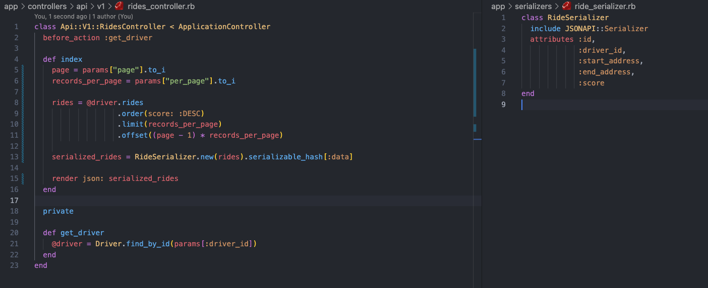
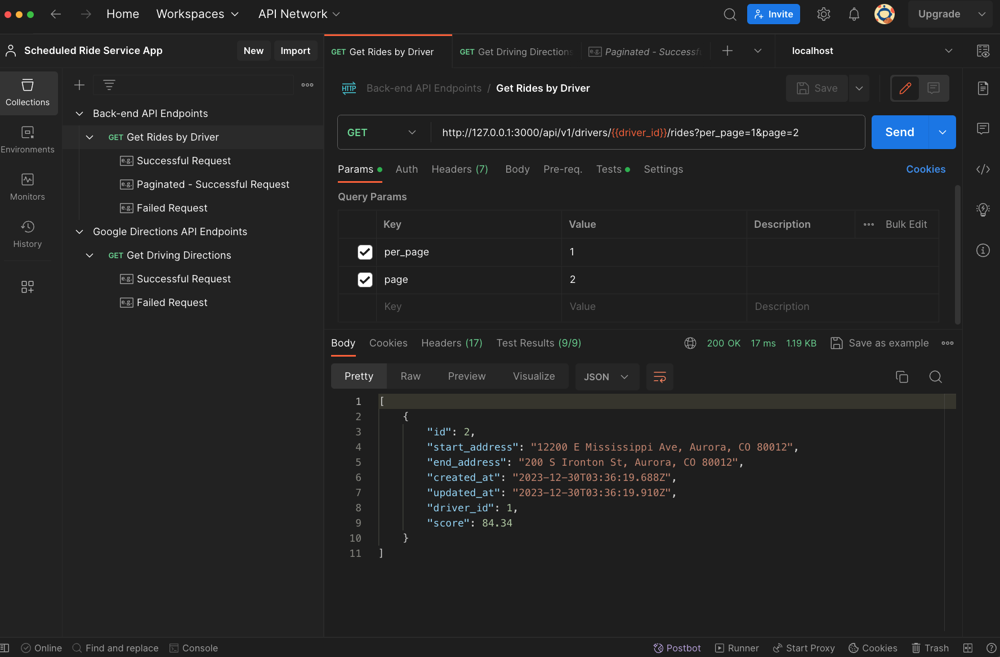
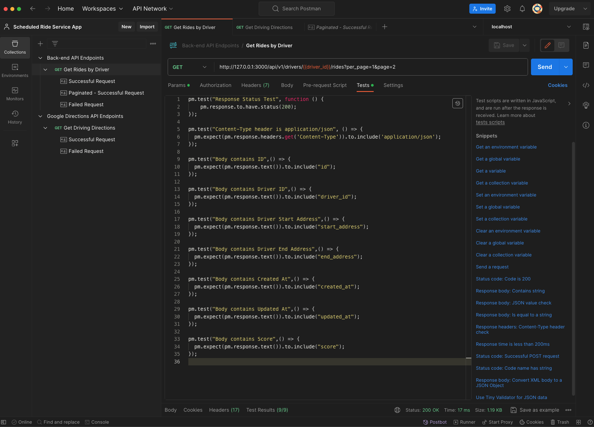
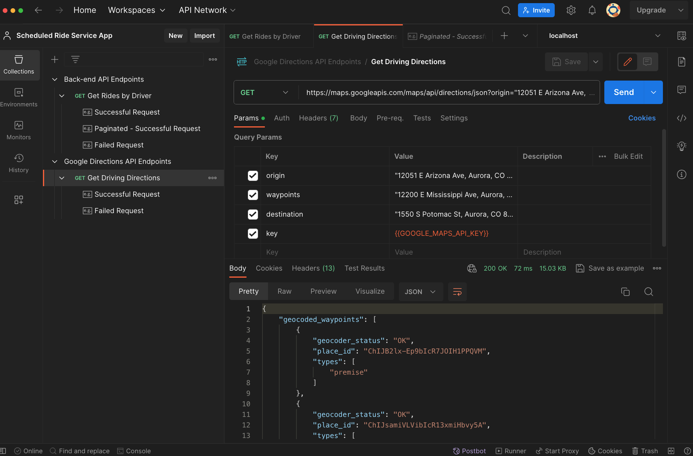
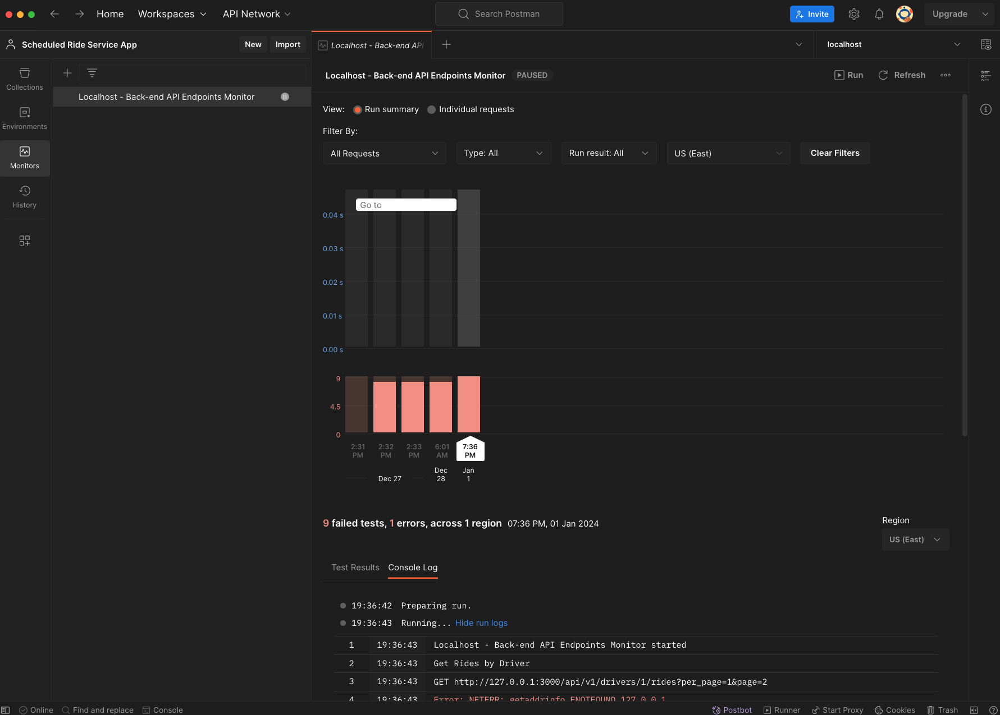

# Justin Mauldin's Rails Assessment:
My Rails API implementation successfully accomplishes the requirements set forth in the [HopSkipDrive Rails Assessment](https://docs.google.com/document/d/1FhyO5fxFIzCF6RIDDnfh4zwls7x974dI8pHB4AUg2Kc/edit?usp=sharing) instructions provided to me.


## Developer Notes
### My Approach & Thought process:
I used Test Driven Development in order to create this whole implementation.  

Additionally, I read through each of the requirements (in the `Specification:` section) from the prompt, made sure I understood them, and worked my way down the list of bullet-points one by one, as I thought they were already in logical order for implementing them.

Finally, where I thought requirements where vague or nonexistent, I just made executive decisions about the implementation and context instead of getting stuck in analysis paralysis, preparing to instead explain the reasoning for the decisions & patterns I made in any follow up discussions with the hiring team.


### My Implementation Choices:
Below are a few key things that I want to call out & explain my implementation decisions on.

  * __Pagination:__ 

    In my research on how best to add pagination to a Rails API endpoint, I ran across this [post](https://thecodeboss.dev/2017/02/building-a-json-api-with-rails-part-6-the-json-api-spec-pagination-and-versioning/) that had an implementation that I liked.  
  
    Because of time constraints, I liked this implementation's ease and quickness for adding pagination. So this why I decided to use the `will-paginate` & `api-pagination` gems and adding a dependency, rather than hand-rolling the pagination implementation.
  
    When I was thinking about the best ways to limit the number of API calls that the `RoutingService`made *(and because I didn't know how a ride record was created, and that was not in the prompt or part of the prompt)*, I thought a good way to limit the calls was to make them a `after_create` method on the `Ride` model.  I then added logic to not allow the method to be called if the existing record already had a `score` value already on it.

    The creation of the ride record is definitely something I plan on asking about in any follow-up conversations to ensure that this implementation would fit in the bigger picture of the app outside of the limited specifications I was given to implement.

 * __Waypoints in the Google Directions API:__
      
    I had not previously worked with the Google Directions API, so as I was going through the documentation & learning how it worked, I quickly found the ability to call `origin` & `destination` to make a call & get the direction & direction data that I needed.

    However, as I dug deeper into the documentation & was also thinking about how to limit the number of "expensive" API calls, I found the [Waypoints](https://developers.google.com/maps/documentation/directions/get-directions#waypoints) option for returning the data for a ride that has a home address, starting address, & ending address.  
    
    This then allowed me to just make 1 API call instead of 2 in order to get the distance & duration data between the 3 addresses for the 2 different "legs" of the journey a driver has to choose from that were part of the requirements.


### Things to add/refactor:
If given more time, below are the things I would add or change to my current implementation.

  * __Serialization:__ 
  
    I know that it can be an important thing for API endpoints to need to customize the shape of the data that is returned, and though it was no explicitly asked for in the requirements, I wanted to implement a Serializer on my endpoint I created to show that I know about them.

    However, when I was experimenting with adding a Serializer via the [jsonapi-serializer](https://github.com/jsonapi-serializer/jsonapi-serializer) gem, it was causing problems with the pagination implementation of the endpoint, and after spending some time reading through the documentation & searching for some answers, I was not getting it to work.

    I did try using the `jsonapi-serializer` with a hand-rolled version of pagination for my endpoint, but due to time constraints, I decided that it would cause too many changes for how deep I was into the implementation of the prompt, and since serialization was not explicitly called for in the requirements, I made the decision it would be something I could add & look into at a later time.
    
    Below is a screenshot of the Serializer & hand-rolled pagination implementation I was experimenting with:
    

  * __Default `per_page` Values:__ 
  
    Though it was not explicitly called for in the prompt requirements, it was brought to my attention that the default behavior for an API endpoint returning all records when not passing in the `per_page` & `page` params might not be the most ideal thing to do, and that having a default `per_page` value that automatically paginates the Ride records by a set number might be a good thing to have on the endpoint by default.

    Again, due to time constraints, I decided that it would cause too many changes for how deep I was into the implementation of the prompt, and since a default value was not explicitly called for in the requirements, I made the decision it would be something I could ask clarifying questions about in any follow-up discussions with the hiring team or be something that I could add at a later time.

  * __Recalculate Ride Score on Update:__ 
  
    One thing that I thought about was that if a Ride's score was calculated at a records creation, something that was likely possible to happen in the future was that the `start_address` or `end_address` value on the record could change & thus change the score of a ride.

    Again, since this was not explicitly called for in the requirements, I made the decision it would be something I could ask clarifying questions about in any follow-up discussions with the hiring team or be something that I could add at a later time.
      
  * __Background Workers:__ 
  
    In every past job I have worked at, the need for asynchronous tasks to be performed in the background that do not keep a user waiting has been something that was really important to the features that we implemented.

    I know that with the implementation of my Ride's score being calculated at record creation, that could possibly take some time & cause an undesirable wait for the end-user.

    The call to the Google Directions API & setting of the Ride's score is something that is perfect for a background worker & would be something that would be needed. 

    If given more time & if the prompt explicitly called for it, I would implement [Redis](https://redis.io/) & [Sidekiq](https://github.com/sidekiq/sidekiq) to add background workers to this app & make that API call an asynchronous task.


## Getting Started
These instructions will get you a copy of the project up and running on your local machine for development and testing purposes.

* ### Prerequisites:
  * Install Ruby (Version 3.1.0)
  * Install Rails (Version 7.0.8)
  * Install PostgreSQL (Version 14.9)
  * Install Bundler (Version 2.4.16)

  * #### Google Directions API Key:
    *For security purposes, my API key for the Google Directions API is stored in an 'application.yml' file that is not checked into source control.*  
    
    *If you are wanting to setup and use this repo to make successful API calls, you will need to reach out to me so that I can give you the key first.* 

    *or*

    *You can create your own Google Cloud API Key for the Google Directions API in your own account by following these [instructions](https://developers.google.com/maps/documentation/directions/get-api-key).*

* ### Installing:
  To run this application locally, clone the [scheduled_ride_service_app](https://github.com/justinmauldin7/scheduled_ride_service_app) repo and follow the steps below:

  * #### Install gems:
    ```
    $ bundle install
    ```

  * #### Create, migrate, & seed the database:
    ```
    $ rake db:setup
    ```

  * #### Start your Rails server:
    ```
    $ rails s
    ```

  * #### Open browser and navigate to:
    ```
    localhost:3000
    ```


## Database Schema


## API Endpoints
Below is a comprehensive list of all the API endpoints that are created & exposed by this Rails API app.

* ### Get All Rides for a Specific Driver:
  There are two ways you can go about returning ride records for a specific driver.  

  First, is to return all rides:  
  ```
  GET /api/v1/drivers/1/rides

  [
    {
      "id": 1,
      "start_address": "12200 E Mississippi Ave, Aurora, CO 80012",
      "end_address": "1550 S Potomac St, Aurora, CO 80012",
      "created_at": "2023-12-30T03:36:19.550Z",
      "updated_at": "2023-12-30T03:36:19.686Z",
      "driver_id": 1,
      "score": 100.74
    },
    {
      "id": 2,
      "start_address": "12200 E Mississippi Ave, Aurora, CO 80012",
      "end_address": "200 S Ironton St, Aurora, CO 80012",
      "created_at": "2023-12-30T03:36:19.688Z",
      "updated_at": "2023-12-30T03:36:19.910Z",
      "driver_id": 1,
      "score": 84.34
    },
    {
      "id": 4,
      "start_address": "12051 E Arizona Ave. Aurora, CO 80012",
      "end_address": "8580 E Lowry Blvd, Denver, CO 80230",
      "created_at": "2023-12-30T03:36:20.181Z",
      "updated_at": "2023-12-30T03:36:20.388Z",
      "driver_id": 1,
      "score": 65.38
    },
    {
      "id": 3,
      "start_address": "12200 E Mississippi Ave, Aurora, CO 80012",
      "end_address": "8580 E Lowry Blvd, Denver, CO 80230",
      "created_at": "2023-12-30T03:36:19.912Z",
      "updated_at": "2023-12-30T03:36:20.179Z",
      "driver_id": 1,
      "score": 53.74
    }
  ]
  ```

  The second is to pass in `per_page` & `per_page` params & return a paginated list of ride records:
  
  ``` 
  GET /api/v1/drivers/1/rides?per_page=2&page=2

  [
    {
      "id": 4,
      "start_address": "12051 E Arizona Ave. Aurora, CO 80012",
      "end_address": "8580 E Lowry Blvd, Denver, CO 80230",
      "created_at": "2023-12-30T03:36:20.181Z",
      "updated_at": "2023-12-30T03:36:20.388Z",
      "driver_id": 1,
      "score": 65.38
    },
    {
      "id": 3,
      "start_address": "12200 E Mississippi Ave, Aurora, CO 80012",
      "end_address": "8580 E Lowry Blvd, Denver, CO 80230",
      "created_at": "2023-12-30T03:36:19.912Z",
      "updated_at": "2023-12-30T03:36:20.179Z",
      "driver_id": 1,
      "score": 53.74
    }
  ]
  ```

  * ### Postman Documentation:
    I created a Personal workspace in Postman for this API endpoint.  The workspace utilizes, collections, tests, environments, global variables, & monitors.

    If given an email address, I can share the workspace with anyone who would like to see it.
    
    However, it is a private/Personal workspace due to it having the API Key for my Google Cloud account for making the API call to the Google Directions API.

    Below are some screenshots displaying its implementation:
      
      * __Rides API Endpoint:__

        

      
      * __Rides API Endpoint Tests:__

        

      
      * __Google Directions API Endpoint:__

        

      
      * __Setup Monitor:__

        
        *(The monitor runs are failing because I don't have the paid version of Postman that allows you to run successful monitor tests on Localhost.)*

 
## Testing
This app was developed using TDD via Rspec tests.  The app is fully tested with all tests passing.

Model tests were created using RSpec & Shoulda Matchers, with HTTP requests being made in tests utilizing VCR & WebMock to record requests & limit API calls.

* ### Running the Full Test Suite:
  From the root of the directory, type the below command to run the full test suite:

  ```
  $ rspec
  ```

* ### Running a Single Test File:
  Type this command from the root of the directory.

  ```
  $ rspec ./spec/requests/api/v1/rides_request_spec.rb

  ```

* ### Running a Single Test From a Single Test File:
  Type this command from the root of the directory.

  *(Just change the line number in the command to run a different test in that file.)*

  ```
  $ rspec ./spec/requests/api/v1/rides_request_spec.rb:25
  ```


## Built With
* [Ruby - Version 3.1.0](https://ruby-doc.org/core-3.1.0/) - Base code language
* [Rails - Version 7.0.8](https://guides.rubyonrails.org/v7.0/) - Web framework used
* [PostgreSQL](https://www.postgresql.org/) - Database used
* [Figaro](https://github.com/laserlemon/figaro) - Securely configures environment variables
* [Faraday](https://github.com/lostisland/faraday) - HTTP Client for making API calls
* [Will Paginate](https://github.com/mislav/will_paginate) - Pagination tool
* [API Pagination](https://github.com/davidcelis/api-pagination) - Pagination tool (used with Will Paginate)

* [RSpec](http://rspec.info/documentation/) - Testing suite
* [Shoulda Matchers](https://github.com/thoughtbot/shoulda-matchers) - Model testing
* [VCR](https://github.com/vcr/vcr) - Recording HTTP requests in tests
* [WebMock](https://github.com/bblimke/webmock) - Stubs out HTTP requests in tests (used with VCR)
* [Pry](https://github.com/pry/pry) - Debugging tool
