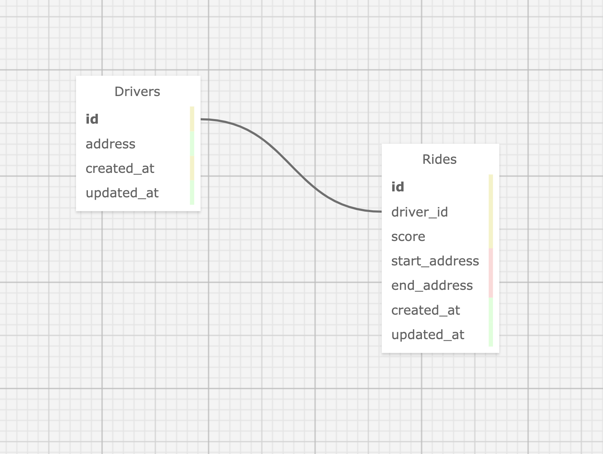

# Justin Mauldin's Rails Assessment:
My Rails API implementation successfully accomplishes the requirements set forth in the [HopSkipDrive Rails Assessment](https://docs.google.com/document/d/1FhyO5fxFIzCF6RIDDnfh4zwls7x974dI8pHB4AUg2Kc/edit?usp=sharing) instructions provided to me.

## Getting Started

These instructions will get you a copy of the project up and running on your local machine for development and testing purposes.

* ### Prerequisites:

  * Install Ruby (Version 3.1.0)
  * Install Rails (Version 7.0.8)
  * Install Bundler (Version 2.4.16)


* ### Installing:

  To run this application locally, clone the [scheduled_ride_service_app](https://github.com/justinmauldin7/scheduled_ride_service_app) repo and follow the steps below:

  * #### Install gems:
    ```
    $ bundle install
    ```


  * #### Create, migrate, & seed the database:
    ```
    $ rake db:setup
    ```


  * #### Start your Rails server:
    ```
    $ rails s
    ```


  * #### Open browser and navigate to:
    ```
    localhost:3000
    ```
## Database Schema


## API Endpoints
Below is a comprehensive list of all the API endpoints that are created & exposed by this Rails API app.

* ### Get All Rides for a Specific Driver:
  There are two ways you can go about returning ride records for a specific driver.  

  First, is to return all rides:  
  ```
  GET /api/v1/drivers/1/rides

  [
    {
      "id": 1,
      "start_address": "12200 E Mississippi Ave, Aurora, CO 80012",
      "end_address": "1550 S Potomac St, Aurora, CO 80012",
      "created_at": "2023-12-30T03:36:19.550Z",
      "updated_at": "2023-12-30T03:36:19.686Z",
      "driver_id": 1,
      "score": 100.74
    },
    {
      "id": 2,
      "start_address": "12200 E Mississippi Ave, Aurora, CO 80012",
      "end_address": "200 S Ironton St, Aurora, CO 80012",
      "created_at": "2023-12-30T03:36:19.688Z",
      "updated_at": "2023-12-30T03:36:19.910Z",
      "driver_id": 1,
      "score": 84.34
    },
    {
      "id": 4,
      "start_address": "12051 E Arizona Ave. Aurora, CO 80012",
      "end_address": "8580 E Lowry Blvd, Denver, CO 80230",
      "created_at": "2023-12-30T03:36:20.181Z",
      "updated_at": "2023-12-30T03:36:20.388Z",
      "driver_id": 1,
      "score": 65.38
    },
    {
      "id": 3,
      "start_address": "12200 E Mississippi Ave, Aurora, CO 80012",
      "end_address": "8580 E Lowry Blvd, Denver, CO 80230",
      "created_at": "2023-12-30T03:36:19.912Z",
      "updated_at": "2023-12-30T03:36:20.179Z",
      "driver_id": 1,
      "score": 53.74
    }
  ]
  ```

  The second is to pass in `per_page` & `per_page` params & return a paginated list of ride records:
  ``` 
  GET /api/v1/drivers/1/rides?per_page=2&page=2

  [
    {
      "id": 4,
      "start_address": "12051 E Arizona Ave. Aurora, CO 80012",
      "end_address": "8580 E Lowry Blvd, Denver, CO 80230",
      "created_at": "2023-12-30T03:36:20.181Z",
      "updated_at": "2023-12-30T03:36:20.388Z",
      "driver_id": 1,
      "score": 65.38
    },
    {
      "id": 3,
      "start_address": "12200 E Mississippi Ave, Aurora, CO 80012",
      "end_address": "8580 E Lowry Blvd, Denver, CO 80230",
      "created_at": "2023-12-30T03:36:19.912Z",
      "updated_at": "2023-12-30T03:36:20.179Z",
      "driver_id": 1,
      "score": 53.74
    }
  ]
  ```
 
## Testing
This app was developed using TDD via Rspec tests.  The app is fully tested with all tests passing.

Model tests were created using RSpec & Shoulda Matchers, with HTTP requests being made in tests utilizing VCR & WebMock to record requests & limit API calls.

* ### Running the Full Test Suite:

  From the root of the directory, type the below command to run the full test suite:

  ```
  $ rspec
  ```

* ### Running a Single Test File:

  Type this command from the root of the directory.

  ```
  $ rspec ./spec/requests/api/v1/rides_request_spec.rb

  ```
* ### Running a Single Test From a Single Test File:

  Type this command from the root of the directory.

  *(Just change the line number in the command to run a different test in that file.)*

  ```
  $ rspec ./spec/requests/api/v1/rides_request_spec.rb:25
  ```

## Built With

* [Ruby - Version 3.1.0](https://ruby-doc.org/core-3.1.0/) - Base code language
* [Rails - Version 7.0.8](https://guides.rubyonrails.org/v7.0/) - Web framework used
* [Figaro](https://github.com/laserlemon/figaro) - Securely configures environment variables
* [Faraday](https://github.com/lostisland/faraday) - HTTP Client for making API calls
* [Will Paginate](https://github.com/mislav/will_paginate) - Pagination tool
* [API Pagination](https://github.com/davidcelis/api-pagination) - Pagination tool (used with Will Paginate)

* [RSpec](http://rspec.info/documentation/) - Testing suite
* [Shoulda Matchers](https://github.com/thoughtbot/shoulda-matchers) - Model testing
* [VCR](https://github.com/vcr/vcr) - Recording HTTP requests in tests
* [WebMock](https://github.com/bblimke/webmock) - Stubs out HTTP requests in tests (used with VCR)
* [Pry](https://github.com/pry/pry) - Debugging tool
